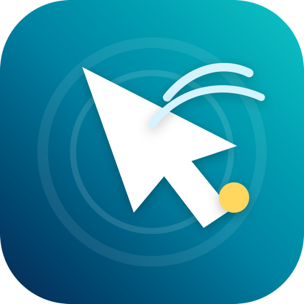
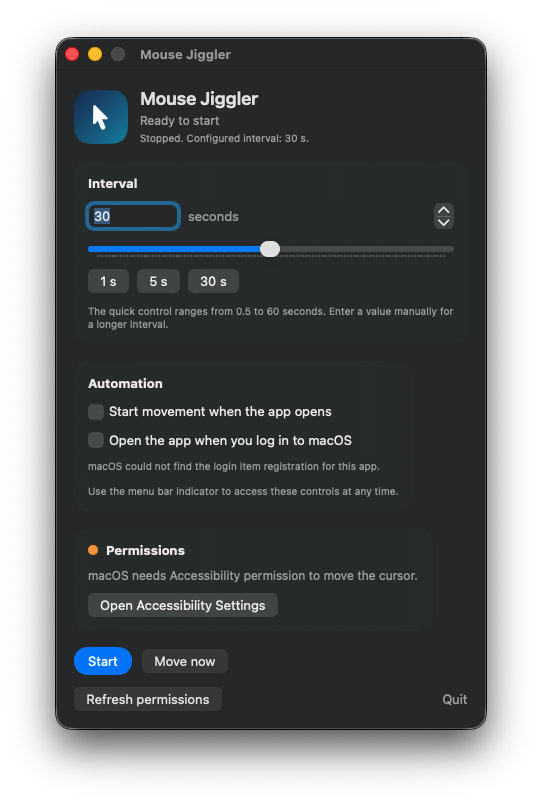
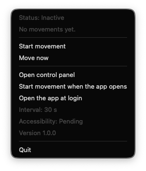

<p align="center">
  
</p>

<h1 align="center">Mouse Jiggler para macOS</h1>

<p align="center">
  Una utilidad nativa y ligera para la barra de menú que ayuda a mantener activa tu sesión mediante movimientos mínimos y configurables del cursor.
</p>

<p align="center">
  <strong>Español</strong> · <a href="README.md">English</a>
</p>

<p align="center">
  <a href="https://github.com/juaneduardovargas/mouse-jiggler/actions/workflows/ci.yml"></a>
  
  
  <a href="LICENSE"></a>
</p>

## Vista previa

| Panel de control | Controles en la barra superior |
| --- | --- |
|  |  |

## ¿Por qué Mouse Jiggler?

Mouse Jiggler es una pequeña utilidad para macOS pensada para ayudar a mantener activa una sesión durante una presentación, una tarea larga, una conexión remota o un proceso supervisado. Funciona de forma local, utiliza frameworks nativos de Apple y no recopila ni transmite información.

### Características

- Intervalo de movimiento configurable entre `0.5` y `3600` segundos.
- Indicador visible `Activo` / `Inactivo` en la barra superior de macOS.
- Acciones rápidas para iniciar, detener, mover una vez y abrir el panel.
- Inicio opcional del movimiento al abrir la aplicación.
- Apertura opcional al iniciar sesión mediante Service Management de macOS.
- Interfaz en inglés y español según el idioma configurado en macOS.
- Implementación nativa con SwiftUI y AppKit, sin dependencias externas.
- Generación de artefactos `.app`, `.zip`, `.dmg` y `.pkg`.

## Requisitos

- macOS 13 Ventura o superior.
- Permiso de Accesibilidad para generar movimientos del cursor.
- Xcode Command Line Tools para compilar desde el código fuente.

El script compila para la arquitectura del Mac que lo ejecuta (`arm64` o `x86_64`). Los mantenedores pueden generar artefactos separados o un binario universal cuando sea necesario.

## Instalación

### Desde una versión de GitHub

1. Descarga el artefacto más reciente desde [Releases](https://github.com/juaneduardovargas/mouse-jiggler/releases).
2. Abre el `.dmg` y arrastra `MouseJiggler.app` a `Aplicaciones`.
3. Abre la app y concede el permiso de Accesibilidad cuando macOS lo solicite.

Mientras no existan versiones oficiales firmadas y notarizadas, macOS puede mostrar una advertencia de Gatekeeper. Para builds personales, haz clic derecho sobre la app y selecciona **Abrir**, o compílala localmente.

### Compilar desde el código fuente

```bash
git clone https://github.com/juaneduardovargas/mouse-jiggler.git
cd mouse-jiggler
zsh Scripts/build_app.sh
```

Artefactos generados:

- `build/MouseJiggler.app`
- `dist/MouseJiggler.app`
- `dist/MouseJiggler.zip`
- `dist/MouseJiggler.dmg`
- `dist/MouseJiggler.pkg`

Los artefactos de compilación y distribución están excluidos de Git de forma intencional.

## Uso

1. Abre Mouse Jiggler.
2. Haz clic en el indicador `Activo` o `Inactivo` de la barra superior.
3. Selecciona **Iniciar movimiento** o abre el panel para configurar el intervalo.
4. Concede acceso en **Ajustes del Sistema → Privacidad y seguridad → Accesibilidad**.
5. Selecciona **Detener movimiento** cuando quieras pausarlo.

La app desplaza el cursor solo unos pocos píxeles y lo devuelve inmediatamente a su posición original.

## Permisos y privacidad

Mouse Jiggler necesita permiso de Accesibilidad porque macOS restringe los eventos de entrada sintéticos. El permiso se utiliza únicamente para publicar movimientos locales del mouse.

- Sin analítica.
- Sin solicitudes de red.
- Sin cuentas ni inicio de sesión.
- Sin historial del cursor almacenado en disco.
- Las preferencias se guardan localmente mediante `UserDefaults`.

Consulta [docs/es/SECURITY.md](docs/es/SECURITY.md) para conocer el proceso de divulgación responsable.

## Traducciones

La app sigue el idioma preferido configurado en macOS. El inglés es el idioma de desarrollo y respaldo; el español está incluido como traducción completa.

```text
Resources/
├── en.lproj/Localizable.strings
└── es.lproj/Localizable.strings
```

Valida la sintaxis y la paridad de claves con:

```bash
zsh Scripts/validate_localizations.sh
```

## Firma y notarización

Los builds locales utilizan firma ad-hoc de manera predeterminada. Para usar identidades Developer ID:

```bash
APP_SIGN_IDENTITY="Developer ID Application: Tu Nombre (TEAMID)" \
INSTALLER_SIGN_IDENTITY="Developer ID Installer: Tu Nombre (TEAMID)" \
zsh Scripts/build_app.sh
```

La firma Developer ID por sí sola no elimina todas las advertencias de Gatekeeper. La distribución pública también debe notarizarse y graparse. El proceso completo está en [docs/es/RELEASING.md](docs/es/RELEASING.md).

## Estructura del proyecto

```text
Sources/MouseJiggler/   Código fuente de la aplicación
Resources/              Metadatos del bundle y traducciones
Scripts/                Herramientas de build, empaquetado y validación
docs/                   Arquitectura, guías de publicación y recursos visuales
.github/                 CI y plantillas de contribución
```

Consulta [docs/es/ARCHITECTURE.md](docs/es/ARCHITECTURE.md) para conocer los componentes internos.

## Solución de problemas

### El cursor no se mueve

Abre **Ajustes del Sistema → Privacidad y seguridad → Accesibilidad**, activa Mouse Jiggler, reinicia la app y selecciona **Actualizar permisos**.

### No aparece el indicador en la barra superior

Cierra copias anteriores de Mouse Jiggler, abre la versión instalada en `Aplicaciones` y verifica que macOS no haya ocultado elementos por falta de espacio en la barra.

### macOS bloquea la app o el instalador

Los builds sin firma o con firma ad-hoc están pensados para desarrollo local. Compila desde el código fuente, usa **Abrir** desde el menú contextual de Finder o instala una versión firmada y notarizada.

### No se puede activar el inicio con la sesión

Mueve la app a `Aplicaciones`, abre esa copia instalada e inténtalo de nuevo. macOS espera que los elementos de inicio permanezcan en una ubicación estable.

## Contribuir

Las contribuciones son bienvenidas. Lee [docs/es/CONTRIBUTING.md](docs/es/CONTRIBUTING.md) antes de crear un pull request y utiliza los formularios bilingües para reportar errores o proponer funcionalidades.

Recursos de la comunidad:

- [Soporte](docs/es/SUPPORT.md)
- [Política de seguridad](docs/es/SECURITY.md)
- [Código de conducta](docs/es/CODE_OF_CONDUCT.md)
- [Registro de cambios](CHANGELOG.md)
- [Guía de publicación](docs/es/RELEASING.md)

## Licencia

Mouse Jiggler está disponible bajo la [Licencia MIT](LICENSE).
