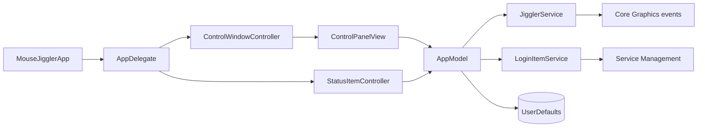

# Architecture

[Leer en español](es/ARCHITECTURE.md)

Mouse Jiggler is a small native macOS application. SwiftUI renders the control panel, while AppKit manages the application lifecycle, Dock presence, window, and menu bar status item.

## Component overview

## Responsibilities

| Component | Responsibility |
| --- | --- |
| `MouseJigglerApp` | SwiftUI entry point and AppKit delegate registration. |
| `AppDelegate` | Creates UI controllers, binds model changes, and owns application lifecycle behavior. |
| `AppModel` | Single source of truth for interval, running state, permissions, notices, and preferences. |
| `ControlPanelView` | Displays configuration, permission state, and primary actions. |
| `StatusItemController` | Renders the persistent menu bar indicator and quick actions. |
| `JigglerService` | Posts a tiny reversible cursor movement using Core Graphics. |
| `LoginItemService` | Registers the main app as a macOS login item. |
| `L10n` | Resolves localized strings from the application bundle. |

## Movement flow

1. The user starts movement from the panel or menu bar.
2. `AppModel` checks Accessibility authorization.
3. A repeating main-run-loop timer is created using the configured interval.
4. `JigglerService` reads the current pointer position, moves it by two pixels, waits briefly, and restores it.
5. The last successful movement time is published to both UI surfaces.

The temporary target point is clamped to the combined desktop bounds so the event remains valid near screen edges and on multi-display setups.

## State and persistence

`AppModel` is a `@MainActor` singleton shared by the AppKit controllers and SwiftUI hierarchy. The interval and automatic-start preference are persisted in `UserDefaults`. Accessibility and login-item states are always queried from macOS rather than treated as locally authoritative.

## Security and privacy boundaries

- Cursor events are posted locally through Core Graphics.
- Accessibility permission is requested through the system API.
- Login-at-launch registration uses `SMAppService.mainApp`.
- The application contains no networking, analytics, telemetry, or remote storage.
- Build signing identities are supplied only through environment variables and are never stored in the repository.

## Build pipeline

`Scripts/build_app.sh` validates localizations, generates the icon set, compiles the Swift sources, constructs the app bundle, signs it, and creates distribution artifacts. Local builds use ad-hoc signing unless Developer ID identities are provided.
