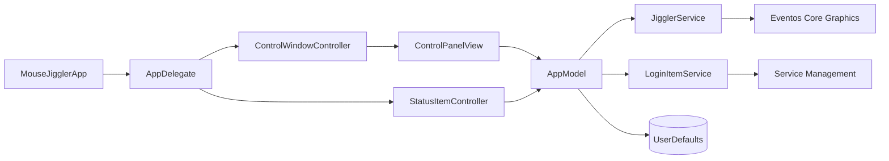

# Arquitectura

[Read in English](../ARCHITECTURE.md)

Mouse Jiggler es una aplicación nativa y pequeña para macOS. SwiftUI renderiza el panel de control, mientras AppKit administra el ciclo de vida, la presencia en el Dock, la ventana y el indicador de la barra superior.

## Vista general de componentes

## Responsabilidades

| Componente | Responsabilidad |
| --- | --- |
| `MouseJigglerApp` | Punto de entrada SwiftUI y registro del delegado AppKit. |
| `AppDelegate` | Crea los controladores de UI, enlaza cambios del modelo y controla el ciclo de vida. |
| `AppModel` | Fuente única de verdad para intervalo, ejecución, permisos, avisos y preferencias. |
| `ControlPanelView` | Muestra configuración, estado de permisos y acciones principales. |
| `StatusItemController` | Renderiza el indicador persistente de la barra superior y sus acciones rápidas. |
| `JigglerService` | Publica un movimiento mínimo y reversible mediante Core Graphics. |
| `LoginItemService` | Registra la aplicación principal como elemento de inicio de sesión. |
| `L10n` | Resuelve las cadenas traducidas desde el bundle de la aplicación. |

## Flujo de movimiento

1. El usuario inicia el movimiento desde el panel o la barra superior.
2. `AppModel` verifica la autorización de Accesibilidad.
3. Se crea un temporizador repetitivo en el run loop principal con el intervalo configurado.
4. `JigglerService` lee la posición actual, desplaza el cursor dos píxeles, espera brevemente y lo devuelve.
5. La hora del último movimiento exitoso se publica en ambas superficies de interfaz.

El punto temporal se limita a los bordes combinados del escritorio para mantener el evento válido junto a los bordes y en configuraciones con varias pantallas.

## Estado y persistencia

`AppModel` es un singleton `@MainActor` compartido por los controladores AppKit y la jerarquía SwiftUI. El intervalo y la preferencia de inicio automático se guardan en `UserDefaults`. Los estados de Accesibilidad e inicio de sesión siempre se consultan directamente a macOS.

## Límites de seguridad y privacidad

- Los eventos del cursor se publican localmente mediante Core Graphics.
- El permiso de Accesibilidad se solicita mediante la API del sistema.
- El inicio con la sesión utiliza `SMAppService.mainApp`.
- La aplicación no contiene red, analítica, telemetría ni almacenamiento remoto.
- Las identidades de firma se proporcionan mediante variables de entorno y nunca se almacenan en el repositorio.

## Proceso de build

`Scripts/build_app.sh` valida las traducciones, genera los iconos, compila las fuentes Swift, construye el bundle, lo firma y crea los artefactos de distribución. Los builds locales utilizan firma ad-hoc si no se proporcionan identidades Developer ID.
